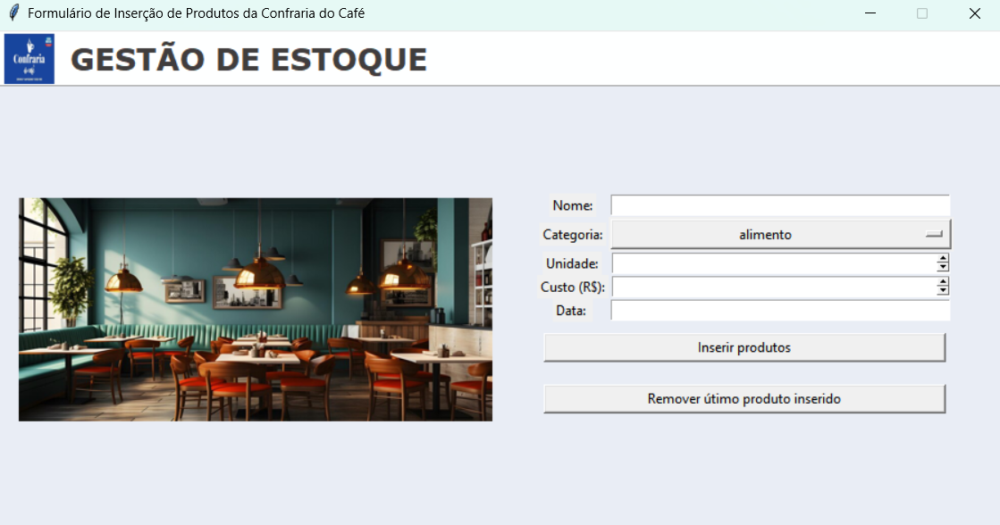
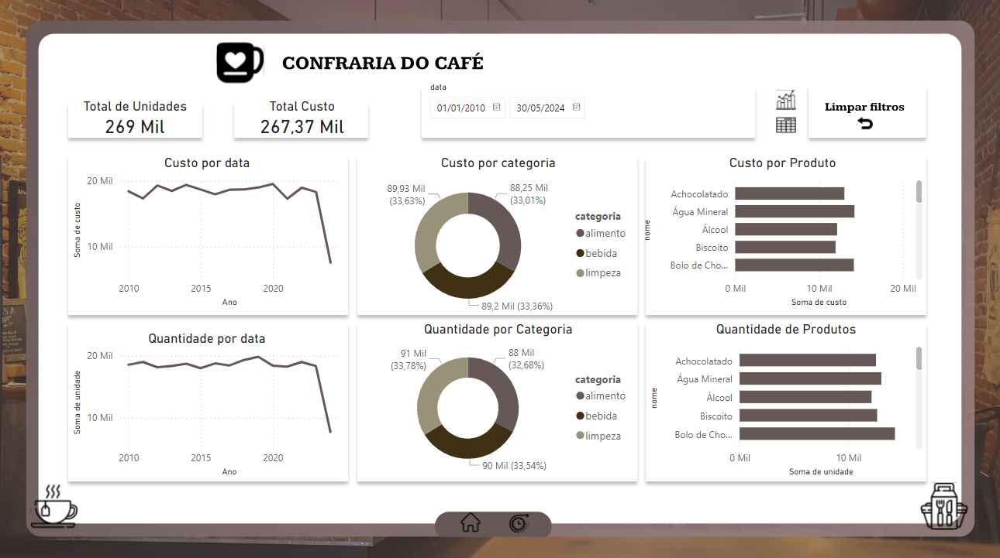
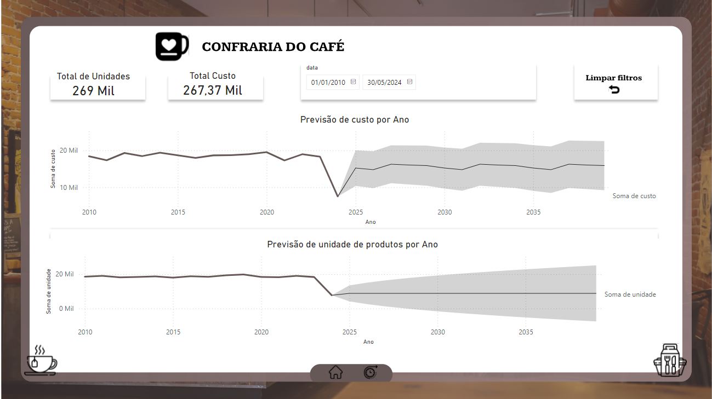

# Sistema de Gestão e análise de dados: Confraria do Café

## Sobre o Projeto :

Trata-se da construção de um sitema com python e sql de uma cafeteria "Confraria do Café" na cidade de Caruaru como colegas da faculdade com base na desciplina de "Tópicos de Big Data com Python". Entramos em contato com o clientes e dentre os requesitos principais do projeto temos armazenamento de dados em uma interface de fácil uso e com bom visual e análise de dados que ajudem na tomada de decisão e der uma visão de como anda a situação de estoque de produtos.

## Atributos:

Para armazenamento de dados será criado as seguintes colunas :

| Campo                  | Descrição                                                                |
|------------------------|--------------------------------------------------------------------------|
| **idprodutos**         | Identificador exclusivo para cada produto inserido                       |
| **categoria**          | Categoria do produto inserido(alimento/bebida/limpeza)                   |
| **custo**              | Custo do produto inserido (R$)                                           |
| **nome**               | Nome do produto inserido                                                 |
| **unidade**            | Quantidade do produto inserido                                           |

## Desenvolvimento:

Desenvolvimento de um sistema python para armazenamento de estoque e construção de um dashboard no power BI do estabelecimento “Confraria do Café”.

1. O Sistema tem o objetivo de trazer uma interface de fácil uso para armazenamento, com uso de Python e SQL com integração do MySQL para inserir ou deletar os produtos.

  
2. No dashboard é possível ter o controle de produtos inseridos por data, categoria e unidade, além do valor de custo com base nos mesmo atributos, cartões e filtros.
<table>
  <tr>
    <td></td>
    <td></td>
  </tr>
</table>

## Equipe:

1. [Micael José de Lima - Desenvolvedor](https://github.com/micaellimaj)
2. [Kauã Vinícius Pereira Santos - Desenvolvedor](https://github.com/kauavinips)
3. [Wendel Vinicius de Oliveira - Desenvolvedor](https://github.com/WendelAgra)
4. [Lucas Figueiroa de Souza - Documentação](https://github.com/LucasFig04)
5. Jucí da Silva Beserra - Documentação

